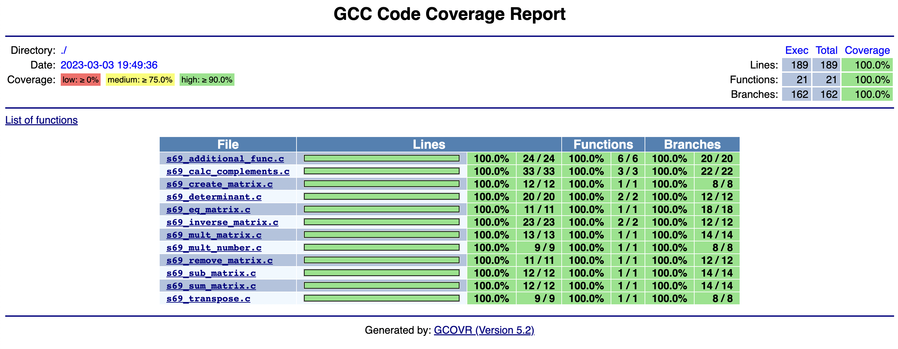
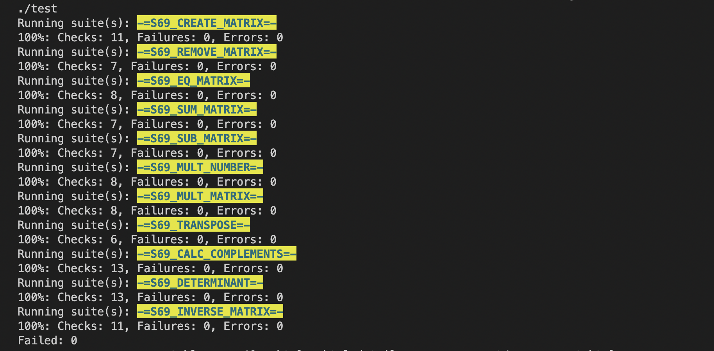

# matrix_library

This project implements the s69_matrix.h library in the C programming language as a part of education in ``School 21`` in Moscow.

The project implements full coverage of library functions code with unit-tests using the ``Check library``. The `gcov_report` target (a part of Makefile) generates a gcov-coverage report

<a>
    
</a>

and the `doxygen` target generates the project documentation in the form of an html page.

### The matrix struct

A matrix is a collection of numbers arranged into a fixed number of rows and columns. The project creates the struct type `matrix_t` which consists of three values:
* double pointer of type `double`;
* `integer` value representing the number of matrix's rows;
* `integer` value representing the number of matrix's columns.

```c
typedef struct matrix_struct 
{
  double **matrix;
  int rows;
  int columns;
} matrix_t;
```

### Synopsis

The project implements basic operations with matrices: create_matrix (creation), remove_matrix (cleaning and destruction), eq_matrix (comparison), sum_matrix (addition), sub_matrix (subtraction), mult_matrix (multiplication), mult_number (multiplication by number), transpose (transpose), determinant (calculation of determinant), calc_complements (calculation of matrix of algebraic complements), inverse_matrix (finding inverse of the matrix).

### Targets

<a>
    
</a>

Please make sure that all the necessary packages are installed on your computer. To install the packeges `cd src` and `make installdeps`. Make sure you have ***homebrew*** on your mac (if not use this <a href="https://docs.brew.sh/Installation">installation options</a>) or use `sudo apt-get install` on your linux.

The library uses *the very unique **Makefile*** to compile the project including basic targets like 
* `s69_matrix.a` or `LIB` for compiling a static library,
* `TEST_LIB` for compiling a static tests' library,
* `test` for compiling tests,
* `all` and `run` for running tests,
* `gcov_report` for creating a tests' coverage report,
* `gcov` for opening an html page,
* `style` for style check,
* `style-fix` for fixing the style,
* `valgrind` for checking leaks and memory errors,
* `check` for cppcheck,
* `docker` for running the script to check the style and compilation,
* `clean` for removing all created files,
* `rebuild` for rebuilding the project,
* `installdeps` for installation of all the necessary packages,
* `doxygen` for creating an html report on the project.

### The author

 *Polina* a.k.a **polza** a.k.a <a href="https://github.com/cormacsi">cormacsi</a>
